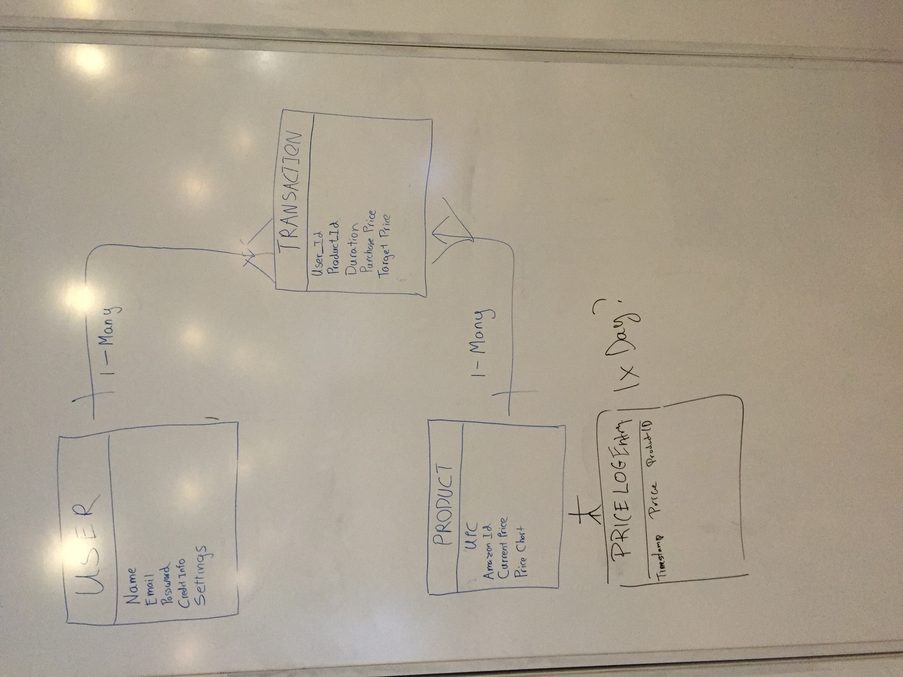
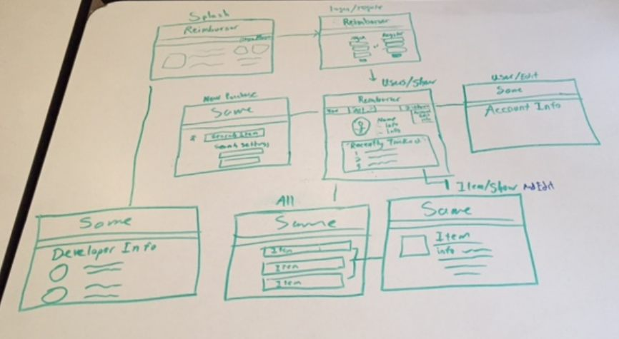

##### Scope

User should be able to....

1. Sign up for an account
2. Create a profile
4. View recently purchased items
5. Manually add and search for items through amazon.
7. Create a "watchlist" and criteria for notification
4. Compare cost of purchased item to cost of same item at other stores
8. Have watchlist notify you if price drops below a certain threshold
7. Create a "watchlist" and criteria for notification
4. Compare cost of purchased item to cost of same item at other stores
8. Have watchlist notify you if price drops below a certain threshold

##### User Stories
User will log in to his account, select a purchase he has made and the app will generate a list of comparisons.
The user will set a cost threshold, and if the potential products's cost dips below the threshold a notification will be generated.
The user will then call his credit card company to initiate a reimbursement.

Later changes include connecting the credit card information to the app to automate  certain aspects.

##### Models

##### Wireframes

##### Milestones
- Planning
- Data Models
- Wireframes Implemented
- Amazon Price Checking Working
- Base Views Complete
- User Login
- Setup OAuth
- Price Watching Working
- Getting Screenshot Proof
- Email Notifications
- Styling
- 1.0 Release
